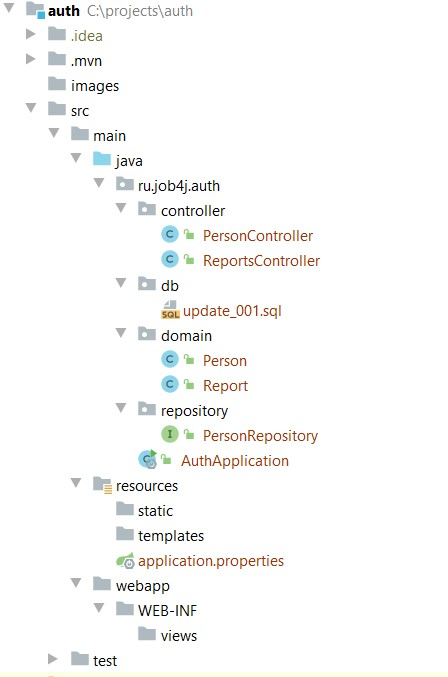
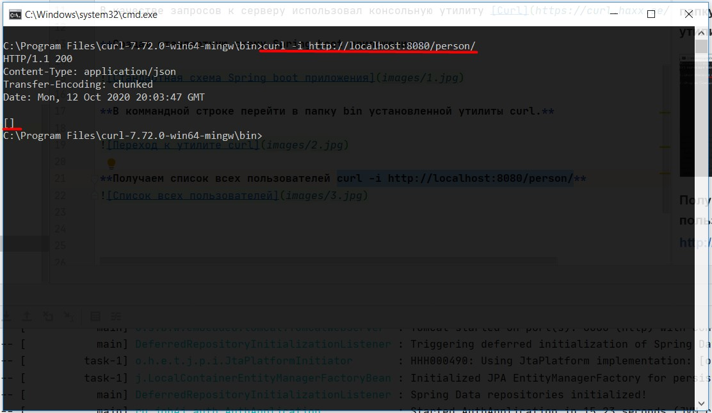
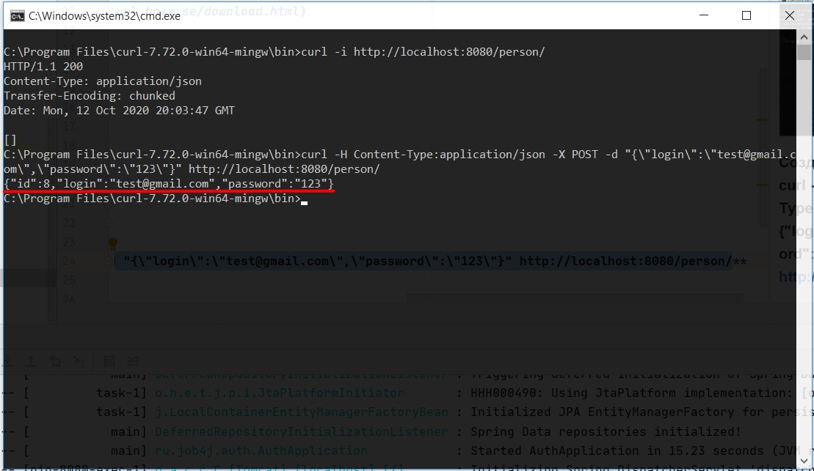
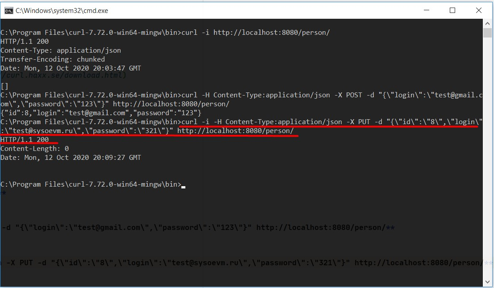
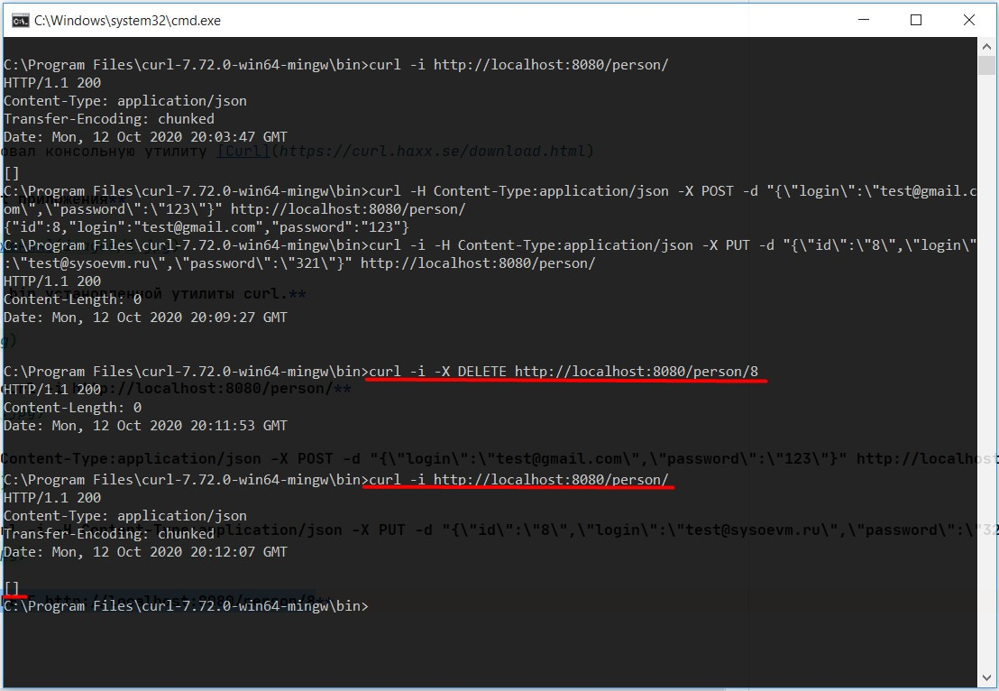

##REST сервис. CRUD опрерации.
application.properties хранит настройки подключения к базе fullstack_auth.
В б.д. fullstack_auth создаю таблицу

create table person (\
    id serial primary key not null,\
    login varchar(2000),\
    password varchar(2000)\
);

В качестве запросов к серверу использовал консольную утилиту [Curl](https://curl.haxx.se/download.html)

**Создаю стандартную схему Spring boot приложения**

**В коммандной строке перейти в папку bin установленной утилиты curl.**

**Получаем список всех пользователей curl -i http://localhost:8080/person/**

**Создаю нового пользователя curl -H Content-Type:application/json -X POST -d "{\"login\":\"test@gmail.com\",\"password\":\"123\"}" http://localhost:8080/person/**

**Обновляю созданного пользователя curl -i -H Content-Type:application/json -X PUT -d "{\"id\":\"8\",\"login\":\"test@sysoevm.ru\",\"password\":\"321\"}" http://localhost:8080/person/**

**Удаление пользователя curl -i -X DELETE http://localhost:8080/person/8**

